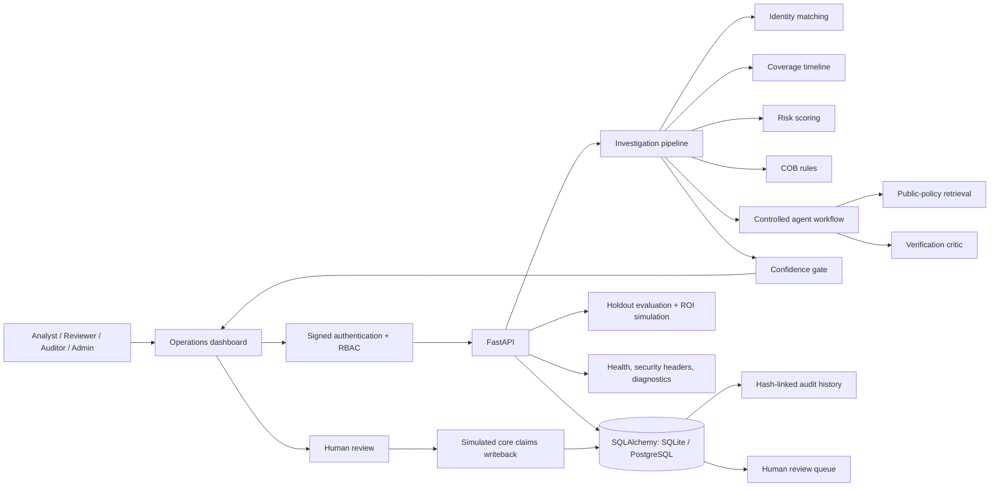

# Baseline architecture

## Production substitutions

| Baseline | Production-oriented replacement |
|---|---|
| SQLite local URL | PostgreSQL/pgvector URL in Compose |
| Keyword retrieval | pgvector embeddings with retrieval evaluation |
| Weighted risk scorer | Calibrated XGBoost model and model registry |
| Fuzzy weighted match | Splink/Fellegi–Sunter entity resolution |
| Python agent state | LangGraph with durable checkpoints |
| Inline processing | Celery/Redis worker with retry and dead-letter policy |
| Static browser UI | React/Next.js application |

The substitutions are behind stable service and API boundaries so the complete
workflow remains operational during the upgrade. The current implementation
already uses SQLAlchemy for both supported database URLs.
